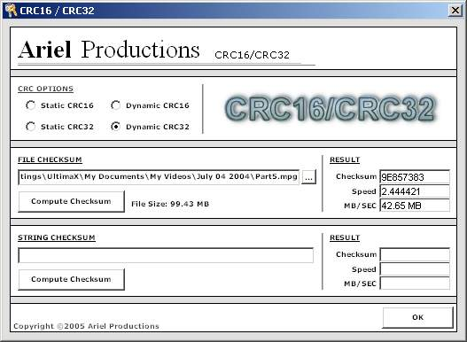



## CRC16/CRC32 Checksum \(Blazing Fast CRC32\)

### Description

This will compute CRC16 and CRC32 checksums for any file, string, or byte array! There is also both the static and dynamic methods for computing them too. The CRC32 checksum is blazing fast and possibly one of the fastest on PSC. (You can see in the screenshot a 100 meg file took but a few seconds) The CRC16 is not highly optimized as I am not going to use it. I just wrote this for the CRC32 checksum and added CRC16 just for giggles. This is going to be used in a commercial product so enjoy. The code is pretty straight forward so it is not heavily commented.

I have not posted here in a long time due to business trips, but I thought I would post this for everyone. Please leave feedback and vote for me. Thanks Everyone.
 
### More Info
 

             |
---                |---
**Submitted On**   |2005-12-01 22:38:24
**By**             |[James Dougherty](https://github.com/Planet-Source-Code/PSCIndex/blob/master/ByAuthor/james-dougherty.md)
**Level**          |Advanced
**User Rating**    |5.0 (10 globes from 2 users)
**Compatibility**  |VB 6\.0
**Category**       |[Libraries](https://github.com/Planet-Source-Code/PSCIndex/blob/master/ByCategory/libraries__1-49.md)
**World**          |[Visual Basic](https://github.com/Planet-Source-Code/PSCIndex/blob/master/ByWorld/visual-basic.md)
**Archive File**   |[CRC16\_CRC31952921212005\.zip](https://github.com/Planet-Source-Code/james-dougherty-crc16-crc32-checksum-blazing-fast-crc32__1-63452/archive/master.zip)

### API Declarations

See Code

